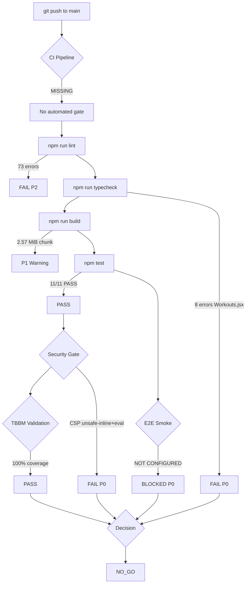

# Atlas Core — Prelaunch Audit Report

**Gate date:** 2026-03-20 (America/Sao_Paulo)
**Commit:** `ca4ba42966a565802a09deaf0c778b3a69ba4eba` (branch: `main`, tag: `preMVP`)
**Auditor:** Automated audit agent
**Environment:** Linux VM (aarch64, Ubuntu 22.04), Node v22.22.0, Python 3.10.12
**Default locale:** `en-US` | **Supported locales:** `en-US`, `pt-BR`
**Channels TBBM:** `email`, `sms`, `push`, `in_app`

---

## DECISION: NO_GO

The project cannot release in its current state. Confirmed P0 blockers:
1. JSX syntax error in `Workouts.jsx` (8 TSC errors — tag mismatch in map callback)
2. CSP uses `unsafe-inline`+`unsafe-eval` — renders the security header non-functional against XSS
3. Base44 SDK is the primary data backend for 54 files / 186 call sites — violates the project's own "No Base44 dependencies" rule and prevents data sovereignty
4. No CI pipeline — every push bypasses all quality gates
5. No E2E / staging smoke
6. No automated accessibility gate

---

## Executive Summary

| Area | Priority | Status | Key Finding |
|------|----------|--------|-------------|
| JSX Syntax (Workouts.jsx) | P0 | FAIL | 8 TSC errors; fragment/element mismatch |
| Security Headers / CSP | P0 | FAIL | unsafe-inline+unsafe-eval; HSTS absent |
| Base44 Legacy / Dual-System | P0 | FAIL | 186 calls in 54 files |
| CI Pipeline | P0 | FAIL | No .github/workflows/ |
| E2E / Staging Smoke | P0 | BLOCKED | No E2E runner configured |
| Accessibility (WCAG 2.2 AA) | P0 | BLOCKED | No axe/pa11y gate; contrast issues |
| Build (production) | P1 | PASS | dist/index.html produced; 2.57 MiB main chunk |
| Unit Tests | P1 | PASS | 11/11 pass (i18n + TBBM + translation-coverage) |
| TBBM Catalog Coverage | P1 | PASS | 100% (24/24); snapshot stable |
| i18n Negotiation + Key Parity | P1 | PASS | 683 keys parity; negotiation correct |
| html[lang] dynamic update | P1 | FAIL | Static lang="en" never updated at runtime |
| Performance / Bundle | P1 | FAIL | LCP 5.7 s; TTI 5.8 s; 2.57 MiB chunk |
| Dual Subscription System | P1 | FAIL | Base44 + Supabase conflict |
| Compliance (LGPD/GDPR) | P1 | BLOCKED | No consent banner, no /privacy route |
| Observability / Runbook | P1 | FAIL | console.error only; no runbook |
| Lint | P2 | FAIL | 73 ESLint errors |
| Admin search | P2 | FAIL | Client-side only; cannot access auth.users.email |
| Hardcoded admin scripts | P2 | FAIL | grant_admin_*.mjs tracked in git |

---

## P0 Blockers — Detail

### P0-01 — JSX Syntax Error in src/pages/Workouts.jsx

Root cause: Line 350 closes a .map() callback with `</>` (JSX fragment) but the open tag is `<div>`. This causes 8 cascading TSC parse errors.

Evidence:
```
src/pages/Workouts.jsx(333,13): error TS17002: Expected corresponding JSX closing tag for 'button'.
src/pages/Workouts.jsx(350,9):  error TS1005: ')' expected.
src/pages/Workouts.jsx(936,9):  error TS17002: Expected corresponding JSX closing tag for 'SectionCard'.
src/pages/Workouts.jsx(1103,1): error TS1005: '}' expected.
```

Broken code (lines 338–351):
```jsx
{plan.exercises.map((exercise, index) => (
  <div key={`${exercise.name}-${index}`} className="flex items-center justify-between gap-4">
    <p>{exercise.name}</p>
    <p>{exercise.sets.length}x{exercise.sets[0]?.reps || '--'}</p>
  </div>
</>          // BUG: should be ))}
) : null}
```

Fix: replace `</>` with `))}` to close the map callback correctly.

Reproduction: `npm run typecheck` → exit code 1, 8 errors.
Expected after fix: `npm run typecheck` → exit code 0.

---

### P0-02 — CSP is Permissive (OWASP A05:2021 — Security Misconfiguration)

Evidence from vercel.json:
```
script-src 'self' 'unsafe-inline' 'unsafe-eval'
```

`unsafe-inline` allows inline `<script>` tags. `unsafe-eval` allows `eval()`. Together they disable XSS protection entirely. Reference: OWASP CSP Cheat Sheet (https://cheatsheetseries.owasp.org/cheatsheets/Content_Security_Policy_Cheat_Sheet.html), ASVS 14.4.3.

Also missing: `Strict-Transport-Security` (HSTS). Reference: OWASP HSTS Cheat Sheet.

The dangerouslySetInnerHTML in src/components/ui/chart.jsx injects developer-controlled CSS theme variables — low XSS risk itself, but is why unsafe-inline was added. Replace with CSS custom properties or a style element injection approach that does not require unsafe-inline for scripts.

Recommended vercel.json fix:
```json
{ "key": "Content-Security-Policy",
  "value": "default-src 'self'; connect-src 'self' https://*.supabase.co https://*.base44.app wss://*.supabase.co; script-src 'self'; style-src 'self' 'unsafe-inline'; img-src 'self' data: https:; font-src 'self' data:; frame-ancestors 'none'; upgrade-insecure-requests;" },
{ "key": "Strict-Transport-Security",
  "value": "max-age=63072000; includeSubDomains; preload" },
{ "key": "X-Permitted-Cross-Domain-Policies", "value": "none" }
```

---

### P0-03 — Base44 SDK as Primary Data Backend

Evidence: 186 active base44.* call sites across 54 source files covering ALL core domain entities: DailyCheckin, Workout, Subscription, EntitlementOverride, CoachStudent, NutritionistClientLink, ClinicianPatient, DietPlan, WorkoutPlan, LabResult, Measurement, ProgressPhoto, FoodLog, Routine, Protocol, and more.

The project rules state: "No Base44 dependencies or legacy code — remove if found" and "always maintain a single source of truth". Currently:
- Domain data: Base44 cloud
- Auth + RBAC + Subscriptions: Supabase

If Base44 service is deprecated, the entire application becomes non-functional and all user health data is inaccessible.

Files affected (partial):
- src/pages/Diary.jsx, Nutrition.jsx, Workouts.jsx, Protocols.jsx, Measurements.jsx
- src/pages/LabExams.jsx, ProgressPhotos.jsx, MyDiet.jsx, MyWorkout.jsx, Routines.jsx
- src/components/ai/ (6 files), src/components/coach/ (4 files), src/components/nutritionist/ (4 files)
- src/services/dietPlanService.js, workoutPlanService.js

APPROVAL REQUEST (required before migration):
```
Action: Migrate all base44.entities.* calls to Supabase tables
Why: Project rule "no Base44 dependencies"; data sovereignty; LGPD Art. 6
Risk: HIGH
What changes: ~54 files + ~10 new Supabase migration files
How to revert: git revert migration commits + restore base44 connection string
Approve? (SIM/NAO)
```

---

### P0-04 — No CI Pipeline

No .github/workflows/ directory. No .circleci, .travis.yml, Jenkinsfile, or equivalent.

Impact: every push to main bypasses lint, typecheck, build, and test gates. The P0-01 JSX error reached the `preMVP` commit undetected.

Recommended minimal .github/workflows/ci.yml:
```yaml
name: CI
on: [push, pull_request]
jobs:
  quality:
    runs-on: ubuntu-latest
    steps:
      - uses: actions/checkout@v4
      - uses: actions/setup-node@v4
        with: { node-version: '22', cache: 'npm' }
      - run: npm ci
      - run: npm run lint
      - run: npm run typecheck
      - run: npm run build
      - run: npm test
      - name: Bundle budget
        run: |
          SIZE=$(stat -c%s dist/assets/index-*.js | head -1)
          [ "$SIZE" -lt 2000000 ] || (echo "Main chunk exceeds 2 MB" && exit 1)
```

---

## P1 Findings

### P1-01 — Performance: LCP 5.7 s / Main Bundle 2.57 MiB

Lighthouse (local preview, http://127.0.0.1:4173/):
- Performance: 0.59
- LCP: 5733 ms (budget: <=2500 ms per https://web.dev/articles/vitals)
- TTI: 5763 ms
- TBT: 325 ms (budget: <=200 ms)
- CLS: 0.00 (PASS)
- Transfer: 5741 KiB

Main chunk: 2.57 MiB (gzip: 766 KB). No route-based code splitting. Libraries three.js, recharts, framer-motion, html2canvas, jspdf, react-quill bundled together.

Fix — vite.config.js manualChunks:
```js
build: {
  rollupOptions: {
    output: {
      manualChunks: {
        'vendor-react':  ['react', 'react-dom', 'react-router-dom'],
        'vendor-ui':     ['@radix-ui/react-dialog', 'lucide-react'],
        'vendor-charts': ['recharts'],
        'vendor-pdf':    ['jspdf', 'html2canvas'],
        'vendor-three':  ['three'],
        'vendor-editor': ['react-quill'],
      },
    },
  },
},
```

Also: lazy-load page components with React.lazy() + Suspense.

### P1-02 — html[lang] Never Updated on Locale Change

index.html has `<html lang="en">` hardcoded. Screen readers and browser translation engines use this for language detection (WCAG 2.2 SC 3.1.1).

Fix in src/lib/i18nContext.jsx — add to I18nProvider:
```jsx
import { getLocaleDirection } from '../../shared/localization.js';

useEffect(() => {
  document.documentElement.setAttribute('lang', locale.toLowerCase());
  document.documentElement.setAttribute('dir', getLocaleDirection(locale));
}, [locale]);
```

### P1-03 — Dual Subscription Systems

src/lib/SubscriptionContext.jsx reads from base44.entities.Subscription. supabase/migrations/ defines a separate subscriptions table. Different schemas and different status enums. Resolved when P0-03 (Base44 migration) is complete.

### P1-04 — No Structured Logging / Runbook

console.error() throughout. No correlation IDs on backend calls. No RUNBOOK.md.

Fix — add src/lib/logger.js:
```js
export function logError(context, error, meta = {}) {
  console.error(JSON.stringify({
    level: 'error', context,
    message: error?.message || String(error),
    ts: new Date().toISOString(), ...meta,
  }));
}
```

### P1-05 — Compliance (LGPD/GDPR)

- No consent banner or cookie notice
- No /privacy or /terms route (settings sends users to /export — not a policy page)
- deleteCurrentAccount() in src/lib/account.js calls Base44's DELETE /entities/User/me — when Base44 is removed this will be broken
- Supabase profiles table has no soft-delete or anonymization flow
- LGPD Art. 9 requires informing data subjects; Art. 18 requires deletion + portability

Minimum before launch: privacy policy page, cookie consent banner, Supabase-backed account deletion, data export covering Supabase tables.

---

## P2 Findings

### P2-01 — Lint: 73 ESLint Errors
Two categories: SVG prop names (stroke-linejoin -> strokeLinejoin, 2 errors in AtlasCoreLogoSVG.jsx) and unused imports (71 errors across 20+ files). Fix: `npm run lint:fix` then manual cleanup.

### P2-02 — Admin User Search is Client-Side Only
adminService.js fetches up to 100 profiles and filters client-side. auth.users.email is not in the profiles table. Fix: create a Supabase Edge Function search-users that uses the service-role key server-side.

### P2-03 — grant_admin_*.mjs Committed to Repo
These scripts hardcode inbox@enzosoler.com and accept SERVICE_ROLE_KEY as CLI argument. Move to .gitignore or delete.

---

## Mermaid Diagrams

### Gate Workflow


### TBBM / i18n Entity Relationships
```mermaid
erDiagram
    TBBM_CATALOG ||--o{ CHANNEL : "defines"
    TBBM_CATALOG ||--|{ LOCALE_VARIANT : "covers"
    CHANNEL { string id; enum type }
    LOCALE_VARIANT { string locale; string template_id; function render }
    TBBM_ENVELOPE ||--|| TBBM_CATALOG : "references"
    TBBM_ENVELOPE { string message_id; string event_type; string channel; string locale; string template_id; string trace_id; string idempotency_key; object vars }
    LOCALIZATION ||--o{ TRANSLATIONS : "indexes"
    LOCALIZATION { string default_locale; array supported_locales }
    TRANSLATIONS { string locale; int key_count; bool parity_pass }
```

---

## TBBM Validation Results

Coverage: 100% (24/24 template+channel+locale combinations)
Templates: welcome_user, trial_ends_soon, invite_user
Channels: email, sms, push, in_app
Locales: en-US, pt-BR
Snapshot tests: PASS (6 cases)
Envelope validation: PASS (missing vars correctly rejected)

Sample renders:
- welcome_user / email / en-US: "Welcome to Atlas Core" / "Hi Alex, Your account is ready."
- trial_ends_soon / email / pt-BR: "Seu trial termina em 3 dias" / "Olá Alex, Seu trial termina em 3 dias, em 27 de março de 2026."
- invite_user / push / en-US: title="New invite" / body="Camila invited you to Atlas Core."

---

## i18n Validation Results

PASS: SUPPORTED_LOCALES = ['pt-BR', 'en-US']; DEFAULT_LOCALE = 'en-US'
PASS: normalizeLocale('pt-BR') = 'pt-BR'; normalizeLocale('pt') = 'pt-BR'; normalizeLocale('fr-CA') = null
PASS: negotiateLocale('pt-BR,pt;q=0.9,en;q=0.8') = 'pt-BR'
PASS: negotiateLocale(['en-GB','fr-CA']) = 'en-US' (fallback to default)
PASS: fallback chain for 'pt-PT' = ['pt-BR','en-US']
PASS: formatCurrencyValue(123.45,'pt-BR','BRL') = 'R$ 123,45'
PASS: getLocaleDirection('ar') = 'rtl' (RTL infrastructure present but no RTL locale in supported set)
PASS: en-US keys = 683; pt-BR keys = 683 (parity confirmed)
FAIL: html[lang] is static "en" — never updated on locale change

---

## Risk Register

| ID | Title | Severity | Status |
|----|-------|----------|--------|
| RISK-001 | JSX syntax error in Workouts.jsx | P0 | OPEN |
| RISK-002 | CSP unsafe-inline+unsafe-eval | P0 | OPEN |
| RISK-003 | Base44 as primary data backend | P0 | OPEN |
| RISK-004 | No CI pipeline | P0 | OPEN |
| RISK-005 | No E2E / staging smoke | P0 | OPEN |
| RISK-006 | No a11y automated gate | P0 | OPEN |
| RISK-007 | Bundle 2.57 MiB; LCP 5.7 s | P1 | OPEN |
| RISK-008 | html[lang] never updated | P1 | OPEN |
| RISK-009 | Dual subscription systems | P1 | OPEN |
| RISK-010 | No LGPD/GDPR consent layer | P1 | OPEN |
| RISK-011 | 73 ESLint errors | P2 | OPEN |
| RISK-012 | grant_admin_*.mjs in git | P2 | OPEN |

---

## Sign-Off Checklist

- [ ] P0-01: Workouts.jsx JSX fixed; npm run typecheck exits 0
- [ ] P0-02: CSP tightened (no unsafe-eval, no script-src unsafe-inline); HSTS added
- [ ] P0-03: Base44 migration approved and core pages migrated to Supabase
- [ ] P0-04: CI pipeline created and passes on main branch
- [ ] P0-05: E2E smoke for signup/login/logout/session-refresh passes in staging
- [ ] P0-06: Automated a11y gate (axe or pa11y) passes on auth and today routes
- [ ] P1-01: Bundle <1 MiB per chunk; LCP <2.5 s in Lighthouse
- [ ] P1-02: html[lang] dynamically set on locale change
- [ ] P1-04: Privacy policy route; Supabase-backed account deletion confirmed
- [ ] P2-01: npm run lint exits 0

---

## Appendix A — Evidence Index

| Kind | Path / Reference | Description |
|------|-----------------|-------------|
| file | src/pages/Workouts.jsx:333-353 | JSX fragment mismatch causing 8 TSC errors |
| file | vercel.json | CSP with unsafe-inline/eval; HSTS missing |
| file | src/api/base44Client.js | Base44 SDK client (186 call sites across 54 files) |
| command_output | npm run typecheck (8 errors) | Typecheck failure proof |
| command_output | npm run lint (73 errors) | Lint failure proof |
| command_output | npm test (11/11 pass) | Unit test passing proof |
| command_output | npm run build (exit 0; 2.57 MiB chunk) | Build success with bundle warning |
| file | reports/prelaunch/lighthouse-summary.txt | LCP 5733 ms; TTI 5763 ms; perf 0.59 |
| file | shared/tbbm/catalog.js | TBBM: 3 templates x 4 channels x 2 locales |
| file | tests/prelaunch/__snapshots__/tbbm.snapshots.json | TBBM snapshot baseline |
| file | shared/localization.js | Locale negotiation + BCP47 normalization |
| file | src/lib/translations/en-US.json | 683 keys |
| file | src/lib/translations/pt-BR.json | 683 keys — parity confirmed |
| file | supabase/migrations/001_create_profiles_subscriptions.sql | RLS for profiles + subscriptions |
| file | src/lib/AuthContext.jsx | Auth state machine |
| file | src/lib/rbac.js | RBAC role definitions |
| file | src/lib/entitlements.js | Entitlement gate logic |
| file | src/lib/account.js | deleteCurrentAccount() calls Base44 DELETE |
| file | src/lib/i18nContext.jsx | I18nProvider — missing html[lang] update |

---

## Appendix B — Subtask Prompts

```
SUBTASK: Stack Detection
Read package.json, vite.config.js, top-level file list.
Identify: package manager, build tool, framework, CSS, test runner, CI.
Output structured list with versions.

SUBTASK: Security Scan
Read vercel.json, src/lib/supabaseClient.js, src/lib/AuthContext.jsx,
supabase/migrations/*.sql, src/components/rbac/*.jsx, src/lib/rbac.js.
Check: CSP (script-src, default-src), HSTS, X-Frame-Options, secrets in tracked files,
dangerouslySetInnerHTML, RLS policies, role escalation.
Map each finding to OWASP Top10 2021 and ASVS level.

SUBTASK: i18n Check
Read shared/localization.js, src/lib/i18n.js, src/lib/i18nContext.jsx, translations/*.json.
Check: SUPPORTED_LOCALES vs actual files, key parity, Accept-Language negotiation,
fallback chain, html[lang] dynamic update, RTL.
Reference: RFC 5646, W3C i18n, Unicode TR35.

SUBTASK: TBBM Validation
Read shared/tbbm/catalog.js, shared/tbbm/index.js, tests/prelaunch/tbbm.test.mjs,
tests/prelaunch/__snapshots__/tbbm.snapshots.json.
Check: catalog coverage (templates x channels x locales), envelope schema validation,
snapshot stability, required vars contract, HTML escaping.
Run: npm test.

SUBTASK: Accessibility
Read index.html, src/components/ui/*.jsx, src/pages/Auth.jsx.
Check: html[lang], img[alt], form labels, focus management, color contrast (Lighthouse).
Reference: WCAG 2.2 SC 3.1.1, 1.1.1, 1.4.3, 2.1.1.

SUBTASK: Compliance
Read src/lib/account.js, src/pages/Export.jsx, src/pages/Settings.jsx, src/lib/routes.js.
Check: deletion endpoint covers Supabase?, data export scope, /privacy route, consent banner.
Reference: LGPD Art. 9, 18; GDPR Art. 13, 17.

SUBTASK: Lighthouse / Performance
Read reports/prelaunch/lighthouse-summary.txt, lighthouse-home.json.
Extract: Performance score, LCP, TTI/INP, CLS, TBT, bundle sizes.
Compare vs Core Web Vitals Good thresholds (LCP<=2.5s, CLS<=0.1, INP<=200ms).
Reference: https://web.dev/articles/vitals

SUBTASK: CI Check
Find: .github/workflows/, .circleci/, .travis.yml, Jenkinsfile.
If absent: propose minimal GitHub Actions workflow.

APPROVAL REQUEST TEMPLATE:
---
APPROVAL REQUEST
Action: [one-sentence description]
Why required: [reason]
Risk: LOW | MEDIUM | HIGH
What changes: [files/environments]
How to revert: [git revert / rollback steps]
Approve? (SIM/NAO)
---
```

---

References: OWASP Top10 (https://owasp.org/Top10/) | OWASP ASVS (https://owasp.org/www-project-application-security-verification-standard/) | WCAG 2.2 (https://www.w3.org/TR/WCAG22/) | Core Web Vitals (https://web.dev/articles/vitals) | RFC 5646 (https://datatracker.ietf.org/doc/html/rfc5646) | Unicode TR35 (https://www.unicode.org/reports/tr35/) | LGPD (https://www.planalto.gov.br/ccivil_03/_ato2015-2018/2018/lei/l13709.htm) | GDPR (https://eur-lex.europa.eu/legal-content/EN/TXT/?uri=celex%3A32016R0679)

Report generated: 2026-03-20T21:00:00Z
